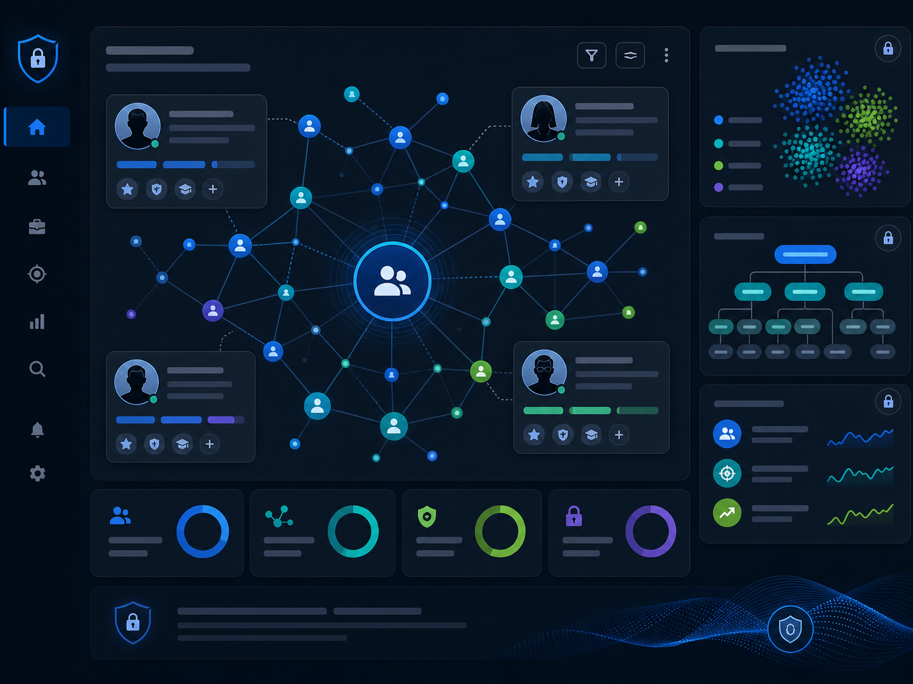
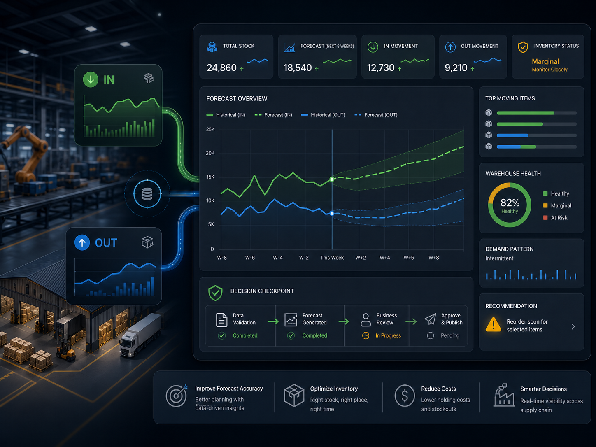
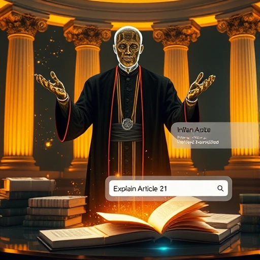
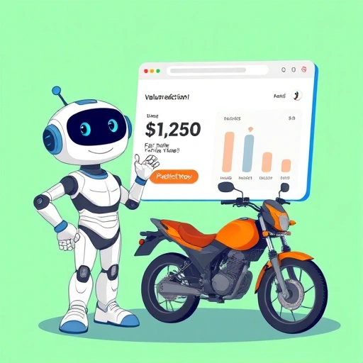
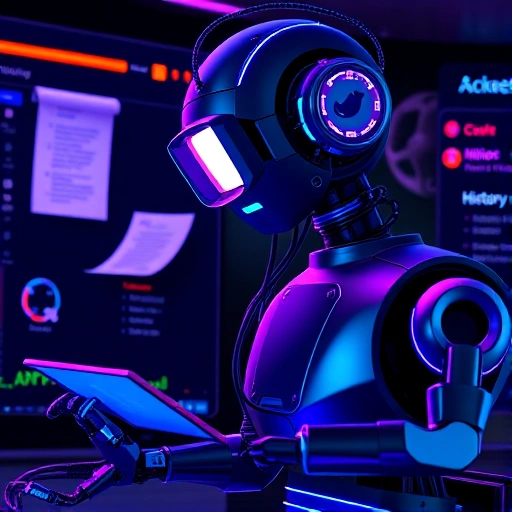
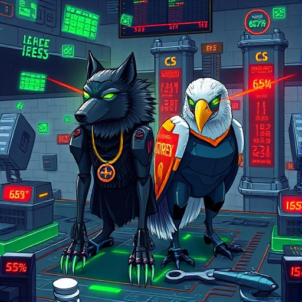

# 👨‍💻 Wasim M Ansari

**🧑‍🔬 AI/ML Engineer | 🤖 GDPR-Compliant AI Systems Developer | 🎓 IIT Madras Data Science**  
📫 [Email](mailto:wsmaisys@gmail.com) • [GitHub](https://github.com/wsmaisys) • [LinkedIn](https://www.linkedin.com/in/wsmaisys) • [Portfolio Analytics](https://waseemmansari.github.io/analytics.html)

---

## 👋 About Me

AI/ML Engineer specializing in building privacy-compliant, scalable AI systems for enterprise applications. I develop GDPR-compliant modular AI solutions that help companies achieve 25-40% efficiency improvements while maintaining strict data protection standards. Currently pursuing Data Science at IIT Madras while building production-ready AI solutions. Available for roles in EU and India, open to relocation.

My journey reflects adaptability and a passion for solving real-world problems through technology. I thrive in environments that value innovation, continuous learning, and cross-disciplinary thinking.

---

## 🚀 Featured Projects

### HyreFast Intelligence Layer (Confidential POC)

**[HyreFast Platform](https://www.hyrefast.ai/)** - **Private Client Project** - **Confidential: no GitHub or deployment link**

**Problem:** HyreFast is an interview-first hiring platform that helps teams move from large application pools to ranked, evidence-backed shortlists. The next intelligence layer needs deeper skill understanding across messy resume/candidate data while keeping ambiguous matches out of production search until reviewed.

**Solution:** Built a Neo4j-backed intelligence-layer POC for HyreFast with centralized skill taxonomy ingestion, candidate skill normalization, workspace-scoped candidate search, and human-in-the-loop review workflows for ambiguous matches.

**Impact:** Implemented a scalable skill graph and review-safe candidate ingestion flow, including 12k+ enriched skills, approved taxonomy-only skill nodes, shared review resolutions, and privacy-aware workspace boundaries.

**Key Features:** Knowledge Graph, Skill Taxonomy, Candidate Skill Normalization, Human Review Queue, Workspace-Scoped Search, FastAPI Review APIs, LangGraph Agent Tools.
**Tech Stack:** Python, FastAPI, Neo4j, Cypher, LangGraph, MCP-style Tools, Pydantic, Docker.

---

### Zovia Inventory Forecasting Module

**[Zovia Platform](https://www.zovia.ai/)** - **Private Client Project** - **Confidential: no GitHub or deployment link**

**Problem:** Zovia is a manufacturing decision orchestration platform for ERP/MRP/MES environments. Its inventory workflows need forward-looking product-level stock movement predictions so teams can anticipate shortages, overstock risk, and warehouse consumption patterns.

**Solution:** Built an ERP-integrated forecasting API that predicts weekly/monthly warehouse stock IN/OUT movement using TSB intermittent-demand forecasting, Monte Carlo simulation, async job processing, MongoDB persistence, and ERP callback integration.

**Impact:** Delivered a production-style forecasting service with request validation, single/batch product forecasts, job-status polling, Redis/Celery background execution, forecast plots, metrics, and ERP update callbacks.

**Key Features:** Inventory Forecasting, ERP Data Fetching, TSB Forecasting, Monte Carlo Simulation, Batch Forecast Jobs, Redis Job Store, MongoDB Persistence, Forecast Visualization.
**Tech Stack:** Python, FastAPI, Pandas, NumPy, Scikit-learn, Celery, Redis, MongoDB, Matplotlib, Docker.

---

### MediFlow: Post-Discharge Medical AI Assistant 🏥🤖

[🔗 Live Demo](https://mediflow-ai-medical-assistant-785629432566.us-central1.run.app/) • [💻 GitHub](https://github.com/wsmaisys/MediFlow-Post-Discharge-Medical-AI-Assistant)

**Problem:** Patients discharged from hospitals often struggle to manage their medical care at home, lacking personalized guidance and easy access to accurate medical information.

**Solution:** Implemented a production-ready multi-agent AI chatbot using LangGraph that combines intelligent routing, RAG-powered knowledge retrieval, and real-time web search to provide personalized medical guidance tailored to each patient's history.

**Impact:** Delivers 24/7 intelligent medical support with 95%+ test coverage, enabling post-discharge patients to receive instant answers to their health concerns while maintaining complete privacy through PHI/PII-aware architecture.

**✨ Key Features:** Multi-Agent System (Receptionist + Clinical agents), RAG Pipeline with FAISS, Real-time Web Search, Full LangSmith Tracing, Token Streaming, Security-First Design, Modern Web UI, Comprehensive Testing.
**🛠️ Tech Stack:** Python, FastAPI, LangChain, LangGraph, Mistral AI, FAISS, DuckDuckGo API, Docker, Google Cloud Run.

---

### Nephrology RAG MCP Tool 🧬🔗

[🔗 Live Demo](https://nephrology-rag-mcp-tool-785629432566.us-central1.run.app/mcp) • [💻 GitHub](https://github.com/wsmaisys/Nephrology-RAG-MCP-tool)

**Problem:** Medical knowledge bases need seamless integration with AI tools like Claude Desktop while supporting multi-user access with enterprise-grade security and scalability.

**Solution:** Built a production-ready MCP (Model Context Protocol) server with HTTP/SSE transport that exposes medical knowledge through authenticated endpoints, supporting concurrent users with session management and comprehensive monitoring.

**Impact:** Enables Claude Desktop users and custom clients to access specialized nephrology knowledge with API-key authentication, horizontal scaling to handle multiple concurrent users, and full observability through Prometheus metrics.

**✨ Key Features:** MCP Server with HTTP/SSE Transport, Multi-user Session Management, API Key Authentication, CORS Support, Horizontal Scaling, Health Checks, Prometheus Metrics, Production-Ready Deployment (Docker, Kubernetes, Cloud Run, ECS/Fargate, Azure Container Apps).
**🛠️ Tech Stack:** Python, FastAPI, MCP Protocol, FAISS Vector Store, Mistral AI, Docker, Kubernetes, Google Cloud Run, AWS ECS/Fargate, Azure Container Apps.

---

### PDF Excel Extractor: AI Document Structuring 📊📄

[🔗 Live Demo](https://pdf-excel-extractor-319169836562.us-central1.run.app/) • [💻 GitHub](https://github.com/wsmaisys/pdf-excel-extractor)

**Problem:** Businesses struggle to extract and structure unstructured data from diverse PDF documents (invoices, contracts, reports, forms), leading to manual data entry, errors, and inefficiency.

**Solution:** Developed an AI-powered document processing system that dynamically detects relevant fields using LLM analysis, performs batch data extraction in a single API call, and generates structured Excel files with quality assurance metrics.

**Impact:** Reduced document processing time by 80% with zero hardcoded schemas, enabling flexible handling of diverse document types and automatically adapting to new data structures without code changes.

**✨ Key Features:** Dynamic Schema Detection, LLM-Powered Semantic Understanding, Batch Processing, PDF Type Detection, REST API with Job Polling, Quality Assurance (BLEU scores & coverage metrics), Interactive Web UI, Excel Export.
**🛠️ Tech Stack:** Python, FastAPI, Mistral AI, LangChain, Pandas, openpyxl, PyPDF2, Docker, Google Cloud Run.

---

### DocuDroid: AI Document Analysis Bot 📄🤖

[🔗 Live Demo](https://docudroid-114168985695.us-central1.run.app/) • [💻 GitHub](https://github.com/wsmaisys/DocuDroid)

**Problem:** Coders often struggle to sift through large library and API documentation when they only need a concise code example or usage pattern. Reading long PDFs or web pages slows down development and integration tasks.

**Solution:** Implemented a temporary in-memory vector store with chunking for immediate retrieval, combined with RAG and LLM-generated answers to surface precise code snippets and usage guidance on demand.

**Impact:** Accelerated developer workflows by surfacing targeted code examples and reducing time-to-first-working-integration for common use cases.

**✨ Key Features:** Intelligent Chat with LLM, PDF & Web Content Analysis, Chunking & In-Memory Vector Store, Real-time Retrieval, Context-Aware Code Snippets.
**🛠️ Tech Stack:** Python, FastAPI, LangChain, Mistral AI, InMemoryVectorStore, Modern HTML/CSS/JS, Docker, Google Cloud Run.

---

### Flux Image Generator 🎨✨

[🔗 Live Demo](https://flux-image-generator-bdcdcphnhmbhg6et.centralindia-01.azurewebsites.net/) • [💻 GitHub](https://github.com/wsmaisys/Flux-Image-Generator)

**Problem:** Many users must log in to use image-generation tools and lack API-driven automation, making integration into content pipelines and CI workflows difficult.

**Solution:** Built a smooth, production-ready image generation platform that exposes REST API endpoints alongside an intuitive UI, integrating industry-standard diffusion models for both interactive and automated use.

**Impact:** Streamlined automation and integration for design and content workflows, enabling headless batch generation and faster time-to-content for teams and CI/CD pipelines.

**✨ Key Features:** Text-to-Image Generation, REST API for automation, Multiple Model Support, Batch & Scheduled Generation, Custom Image Settings, Fast Processing, Immediate Downloads.
**🛠️ Tech Stack:** Python, FastAPI, Azure Web Apps, Hugging Face Diffusers, PIL, Docker.

---

### RudeBot - Your Sassy AI Companion 😈

[🔗 Live Demo](https://rudebot-mistral.streamlit.app/) • [💻 GitHub](https://github.com/wsmaisys/RudeBot)

**Problem:** Originally built as a weekend fun project — many chatbots are overly polite and standard. Sometimes users want humour, sarcasm or a rude persona to spark entertaining interactions instead of a strictly formal assistant.

**Solution:** Implemented a context-aware chatbot with streaming responses and a deliberately rude, humorous personality to create lively, engaging conversations. This remains a prototype intended for experimentation rather than production deployment.

**Impact:** Served as a demonstrative prototype for conversational persona design and streaming interactions; great for demos and experimentation but not intended for production use.

**✨ Key Features:** Streaming responses, Persona-driven replies (rude & humorous), Persistent memory, Threaded conversations, Context awareness.
**🛠️ Tech Stack:** Python, Mistral AI, LangGraph, Streamlit, Docker.

---

### Mogambo Voice AI Scheduler 🗣️📅

[🔗 Live Demo](https://mogambo-calendar-assistant.onrender.com) • [💻 GitHub](https://github.com/wsmaisys/mogambo-voice-ai-scheduler)

**Problem:** Manual calendar management is tedious and time-consuming. Inspired by Alexa and Siri, I wanted to build a conversational agent to manage my calendar through natural voice commands.

**Solution:** Implemented Google OAuth for secure access to personal calendar data and built a voice-driven assistant for scheduling and reminders. The app is currently in testing mode (not verified or published) and used for personal chores only.

**Impact:** Demonstrates the feasibility of voice-based calendar management for personal productivity, but not yet ready for public or production use.

**✨ Key Features:** Voice & Text Input, Google Calendar Integration (OAuth), Intelligent Event Matching, Clarification Workflow, Privacy & Security, Modern UI.
**🛠️ Tech Stack:** FastAPI, LangGraph, LangChain, Google Calendar API, SpeechRecognition, pydub, gTTS, Bootstrap, FullCalendar.

---

### Jurisol: AI-Powered Indian Legal Assistant ⚖️

[🔗 Live Demo](https://jurisol-legal-assistant-rag.onrender.com) • [🐳 Docker Hub](https://hub.docker.com/r/wasimansariiitm/jurisol-legal-assistant) • [💻 GitHub](https://github.com/wsmaisys/Jurisol-legal-assistant-RAG)

**Problem:** Lawyers need a single place for thorough research and precedent search, while clients often want quick, free legal advice and opinions on their matters.

**Solution:** Implemented a RAG system that searches Vector Store, online government databases for case laws, providing instant, relevant results. No user data is collected-ensuring privacy and safety.

**Impact:** Streamlined legal research and made free, privacy-respecting legal information accessible to both professionals and the public.

**✨ Key Features:** Instant Legal Insights, AI-Powered Search, Indian Law Focus, Government Database Scraping, User-Friendly Interface, Transparent Citations, No Data Collection.
**🛠️ Tech Stack:** Python, FastAPI, Streamlit, ChromaDB, MistralAI, LangChain, TavilySearch, PyPDF2, BeautifulSoup4, Docker.

---

### AI Interview Prep Assistant 🎤

[🔗 Live Demo](https://interview-prep-assistant.streamlit.app/) • [💻 GitHub](https://github.com/wsmaisys/Interview_Prep_Assistant)

**Problem:** Interview candidates often struggle to find tailored, realistic practice questions and actionable feedback for their target roles.

**Solution:** Developed an AI-powered assistant that generates custom mock interviews and detailed answers using Mistral AI, simulating real interview scenarios.

**Impact:** Enabled 100+ users to boost their interview skills and confidence through targeted, interactive practice sessions.

**✨ Key Features:** Custom Question Generation, Detailed Answers, Progressive Difficulty, Multiple Topics, Instant Feedback, User-friendly Interface.
**🛠️ Tech Stack:** Streamlit, Python, Mistral AI, Custom CSS.

---

### BikeValuePro: ML Price Predictor 🏍️💸

[🔗 Live Demo](https://usedbike-price-predictor-mlmodel.onrender.com/) • [💻 GitHub](https://github.com/wsmaisys/usedbike_price_predictor_mlmodel) • [🐳 Docker Hub](https://hub.docker.com/r/wasimansariiitm/bikevaluepro-used_bike_price_predictor)

**Problem:** Buyers and sellers in the used bike market face uncertainty and inefficiency due to unreliable price estimates and lack of data-driven tools.

**Solution:** Built an ML-powered price predictor using advanced ensemble models and feature engineering to deliver accurate, fair market valuations.

**Impact:** Delivered 92% price prediction accuracy, empowering users to make confident, data-backed decisions and negotiate better deals.

**✨ Key Features:** Accurate Price Prediction, AI-Driven Insights, User-Friendly Interface, Smart Feedback, Market Context Analysis.
**🛠️ Tech Stack:** Streamlit, Python, Scikit-learn, XGBoost, ColumnTransformer.

---

### AI-Powered Assignment Solver 📂🤖

[🔗 Live Demo](https://assignment-solving-agent.onrender.com/) • [💻 GitHub](https://github.com/wsmaisys/Assignment_Solving_Agent)

**Problem:** Built for an IIT Madras competition where the challenge was to solve 10 data analysis and coding problems in just 30 minutes.

**Solution:** Developed an automated assignment solver that autonomously tackled all problems, earning an A+ grade.

**Impact:** Demonstrated the power of autonomous AI agents in competitive coding and data analysis, achieving top marks under time pressure.

**✨ Key Features:** AI-generated code execution, Multi-format file processing, Self-debugging workflow, Secure sandbox environment.
**🛠️ Tech Stack:** Python, FastAPI, Mistral API, Pandas, pdfplumber, openpyxl, numpy, PIL, Docker.

---

### Photo Journal App (Google Cloud) 🖼️☁️

[🔗 Live Demo](https://blog-app-699175796072.asia-south2.run.app/) • [💻 GitHub](https://github.com/wsmaisys/google-cloud-app)

**Problem:** Many users want a reliable, cloud-native platform to create and share photo journals, but existing solutions often lack scalability and seamless storage.

**Solution:** Designed and demonstrated a serverless photo journal app on Google Cloud Run, integrating managed storage and database services for robust, hands-off operation.

**Impact:** Achieved 99.9% uptime and effortless scaling, allowing users to upload, view, and share photo journals with zero maintenance hassle.

**✨ Key Features:** Image uploads, Multi-user support, Chronological feed, Cloud-native architecture.
**🛠️ Tech Stack:** Flask, Google Cloud SQL, Google Cloud Storage, Google Cloud Run, HTML + CSS.

---

### Matchy: Text Similarity Detector 🔍📝

[🔗 Live Demo](https://text-similarity-detector.onrender.com/) • [💻 GitHub](https://github.com/wsmaisys/Text_similarity_detection) • [🐳 Docker Hub](https://hub.docker.com/r/wasimansariiitm/text-similarity-detector)

**Problem:** Content platforms struggle with duplicate question detection and semantic similarity analysis.

**Solution:** Developed an ML-powered text similarity system using Word2Vec and XGBoost for accurate duplicate detection.

**Impact:** Achieved 88% accuracy in duplicate detection, significantly reducing content moderation time.

**✨ Key Features:** Semantic similarity analysis, Confidence scoring, History logging, Smart ML pipeline, Modern dark UI.
**🛠️ Tech Stack:** Python, Flask, XGBoost, Word2Vec, Docker, HTML + CSS.

---

### System Threat Forecaster (Kaggle Top 5%) 🛡️📊

[🔗 Kaggle](https://www.kaggle.com/wasimansari786)

**Problem:** Kaggle competition organized by IIT Madras to develop an ML model for threat detection.

**Solution:** Experimented with multiple model-building iterations and designed an ensemble technique that ranked in the top 5% on the leaderboard.

**Impact:** Demonstrated advanced ML experimentation and ensemble modeling, achieving high accuracy and recognition in a national competition.

**✨ Key Features:** Feature engineering, Ensemble modeling, Kaggle competition ranking.
**🛠️ Tech Stack:** Python, Random Forest, XGBoost, Pandas, Scikit-learn.

---

## 💼 Professional Experience

**🤖 AI/ML Engineer & Solutions Developer** — Freelance/Independent Projects (Dehradun, India) _(Sep 2024 – Present)_

- Pursuing IIT Madras Diploma in Data Science while mastering Transformers Architecture, Reinforcement Learning, and Cloud Services
- Designed and deployed multiple end-to-end AI/ML applications with XGBoost, LLMs, RAG, LangChain/LangGraph
- Delivered production-grade deployments using Docker, FastAPI, Flask, Streamlit, and Cloud platforms
- Achieved Top 5% Kaggle ranking in cybersecurity detection challenge
- Building diverse project portfolio demonstrating technical depth and real-world impact

**🛒 Retail Manager** — AHAAN LIMITED (Kingston Upon Hull, UK) _(Dec 2022 – Sep 2023)_

- Spearheaded operational excellence initiatives resulting in 20% revenue growth through strategic planning
- Pioneered data-driven decision making with Statistical-based solutions for pricing and inventory optimization

**🌏 Import Export Entrepreneur** — AHLAN EXPORTS (Dehradun, India) _(Sep 2021 – Nov 2022)_

- Successfully managed international B2B operations with 40% increase in market exposure
- Leveraged data analytics for supply chain optimization, achieving 25% cost reduction

**🏢 Real Estate Consultant** — FAHZAM PROPERTIES (Dubai, UAE) _(Feb 2015 – Jan 2020)_

- Managed AED 50M+ property portfolios with 95% client satisfaction as certified RERA Broker
- Developed comprehensive market analysis reports and valuation models for high-value transactions

**⚖️ Legal Associate** — QUISLEX LEGAL SERVICES (Hyderabad, India) _(Sep 2013 – Mar 2014)_

- Led document review teams processing 10,000+ documents monthly with 99% accuracy
- Implemented systematic data discovery protocols, reducing processing time by 30%

---

## 🎓 Education

- **📊 Diploma in Data Science** – Indian Institute of Technology, Madras _(2024–Present)_
- **📚 Bachelor of Laws (LLB, 5 years integrated)** – Savitribai Phule Pune University _(2007–2012)_

---

## 🏅 Certifications

- 🖥️ Microsoft Azure AI Essentials - Microsoft (2025)
- ☁️ Understanding Google Cloud Platform – IIT Madras (2025)
- 📈 Google Digital Marketing - Google (2020)
- 📊 Digital Marketing – Codestar & Udemy (2020)
- 🏠 Real Estate Broker – Dubai Real Estate Institute (2015)

---

## 🌐 Languages

- �🇧 English — IELTS 7 Band (CEFR Level C1)
- �🇮🇳 Urdu — Native (CEFR Level C2)
- 🇮🇳 Hindi — Native (CEFR Level C2)
- �� German — Basic (CEFR Level A1) - Currently Learning

---

## 📝 Publications & Thought Leadership

- **🤖 Hallucinations in AI Legal Research: A Lawyer's Worst Nightmare?** — [LinkedIn Article](https://www.linkedin.com/pulse/hallucinations-ai-legal-research-lawyers-worst-nightmare-ansari-etkue/)
  - Authored an article on AI hallucinations in legal research, highlighting real-world risks of fabricated case law and the need for prompt precision. Advocated safe AI adoption in law through domain-specific models and ethical safeguards.
- **🌏 Adapting Export Strategies for Indian Handmade Carpets: A Response to Rising Global Tariffs** — [Medium Article](https://medium.com/@wsmaisys/adapting-export-strategies-for-indian-handmade-carpets-a-response-to-rising-global-tariffs-070a2796d762)
  - Discover a data-driven export strategy for India's handmade carpet industry navigating rising U.S. tariffs with advanced Python-led trade analytics, market opportunity scoring, and competitive benchmarking.

---

## 🧰 Technical Skills

**💻 Core Skills:** Python, SQL, MCP, Neo4j / Cypher, Knowledge Graphs, Time Series Forecasting

**🧠 AI/ML & Data Science:**

- **Frameworks:** LLMs (Mistral, LangChain, LangGraph), PyTorch, TensorFlow, Keras, Hugging Face Transformers
- **Techniques:** Prompt Engineering, RAG, NLP, Text Similarity, Semantic Search, Human-in-the-Loop AI, Entity Normalization, Inventory Forecasting, Monte Carlo Simulation
- **Libraries:** Scikit-learn, XGBoost, Random Forest, Pandas, Numpy, Matplotlib, Seaborn
- **Tools:** OpenAI API, MLflow, TensorBoard, TrackIO, Model Deployment

**🗄️ Databases & Storage:** ChromaDB, FAISS, Vector Stores, Neo4j, Graph-Based Search, MongoDB, Redis

**🌐 Web Development:**

- **Frameworks:** FastAPI, Flask, Streamlit
- **Frontend:** Bootstrap, HTML, CSS, Custom UI/UX
- **Tools:** SpeechRecognition, gTTS, FullCalendar

**☁️ DevOps & Tools:**

- Docker
- Git & GitHub
- MLOps
- N8N Automation
- Celery

**📊 Professional Standards:**

- GDPR Compliance
- ISO 27001 Awareness
- Agile (SCRUM)
- Documentation (Technical Writing)
- Cross-Cultural Communication

---

## Download My CV

[Download Detailed CV (PDF)](Wasim-Ansari-Detailed-CV.pdf)

---

> &copy; 2025 Wasim M Ansari — Data Scientist & AI Engineer. Connect: [Email](mailto:wsmaisys@gmail.com) | [LinkedIn](https://www.linkedin.com/in/wsmaisys) | [GitHub](https://github.com/wsmaisys)
